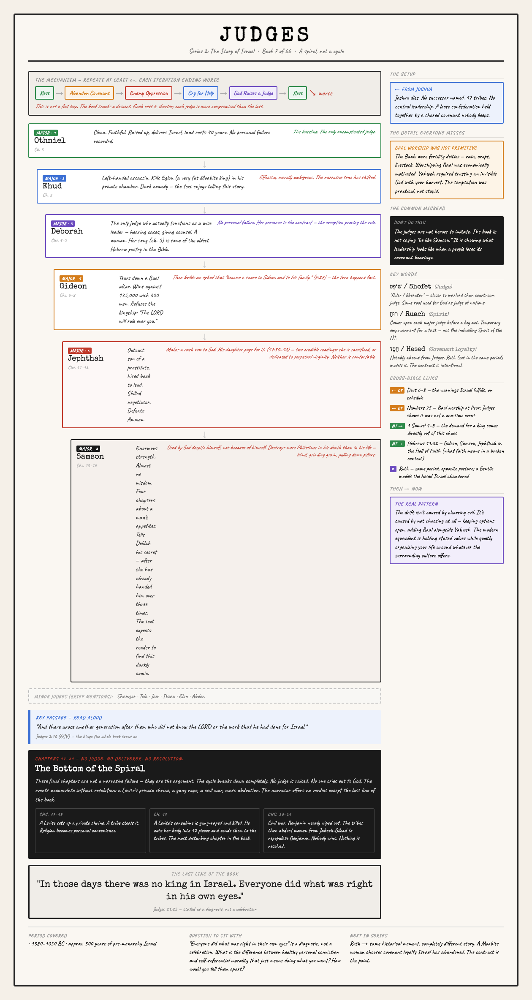
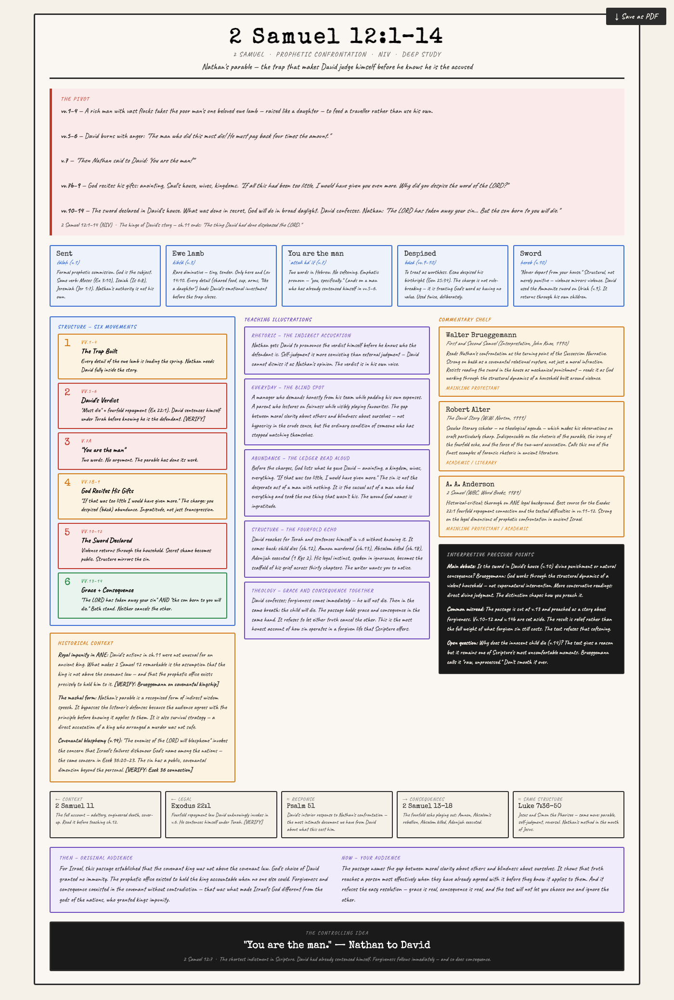
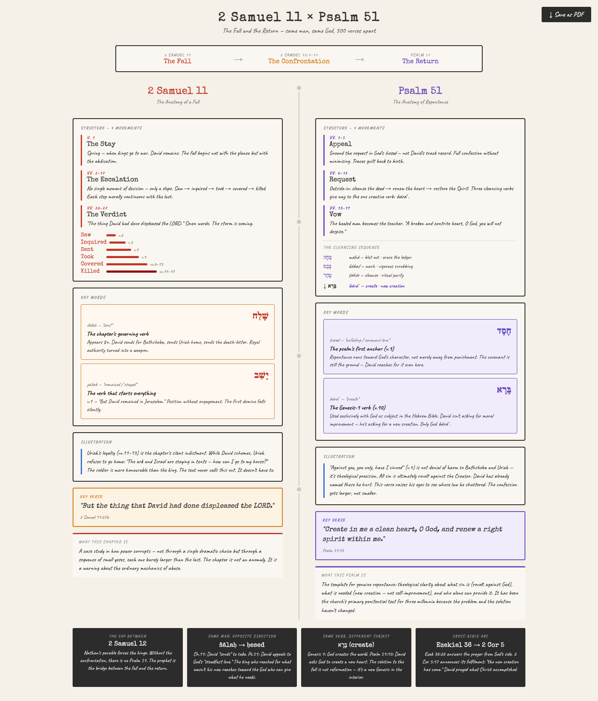
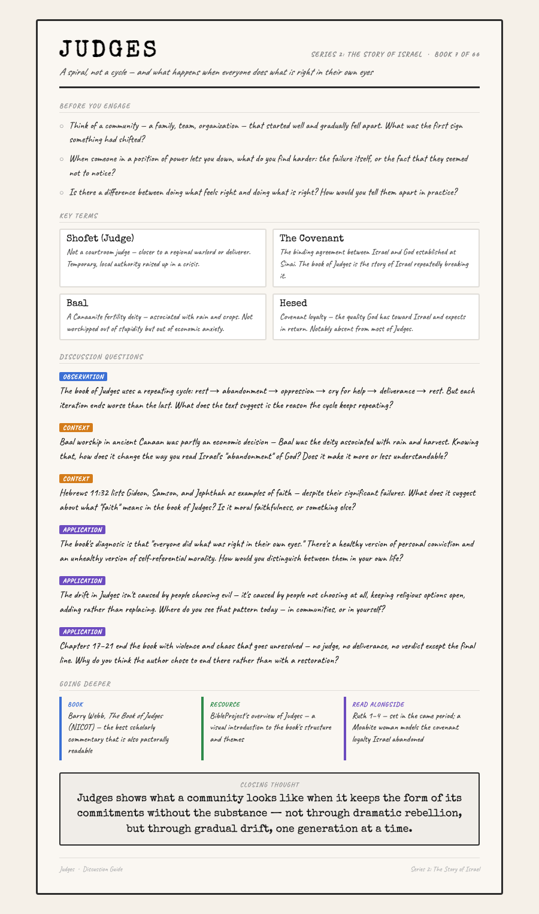

# Bible Teacher — AI Skill Toolkit

A set of Claude Code skills for producing Bible teaching content — visual panels, passage studies, discussion guides, and book comparisons.

Adapted from the [pastor-ai-skills](https://github.com/tkcostello/pastor-ai-skills/) architecture by Thomas Costello.

---

## Get Claude

This toolkit runs on [Claude](https://claude.ai) by Anthropic.

**Option A — Claude.ai (browser, easiest)**
1. Go to [claude.ai](https://claude.ai) and create a free account
2. Upgrade to Claude Pro for best results (required for long research sessions)
3. Create a **Project** — this keeps your teacher profile and skills persistent across conversations

**Option B — Claude Desktop (recommended for most teachers)**
1. Download the Claude desktop app for [Mac or Windows](https://claude.ai/download)
2. Sign in with your Anthropic account (or create one)
3. Create a **Project** and add your skill files — works identically to Claude.ai but as a native app
4. Upgrade to Claude Pro for best results

**Option C — Claude Code (terminal, for power users)**
1. Install [Node.js](https://nodejs.org) if you don't have it
2. Install Claude Code:
   ```bash
   npm install -g @anthropic-ai/claude-code
   ```
3. Authenticate:
   ```bash
   claude
   ```
   Follow the prompts to connect your Anthropic account.

---

## Install the Toolkit

### Option 1 — Install all skills at once (Claude Code)

Copy the repo URL, paste it to Claude and say:

```
install skills from https://github.com/ken-muturi/bible-teacher
```

Claude fetches the skills manifest, creates all skill directories, and confirms everything is installed.

**Skills installed:**

| Skill | Trigger | What it does |
|-------|---------|--------------|
| **Book Overview** | `book-overview <Book>` | Visual panel for any Bible book — layout adapts to the book's structure |
| **Passage Study** | `passage-study <ref> [--deep]` | Quick or full deep-dive for any verse or chapter — words, illustrations, xrefs |
| **Discussion Guide** | `discussion-guide <Book>` | Small-group study companion for any Bible book |
| **Teacher Foundation** | Edit `SKILL.md` directly | Set tradition, translation, and theology once — all skills inherit it |
| **Install Skill** | `install all skills: <url>` | Meta-skill: install one or all skills from a URL |

> **First time?** You need the `install-skill` skill to bootstrap the rest. Install it once manually:
> ```
> install skill https://raw.githubusercontent.com/ken-muturi/bible-teacher/main/install-skill/SKILL.md
> ```
> Then run the one-liner above to install everything else.

**Already installed? Get the latest version:**

```
update skills from https://github.com/ken-muturi/bible-teacher
```

Or simply:

```
update skills
```

Claude will fetch the latest version of every skill and overwrite the existing files. New skills added to the repo since your last install will be added automatically.

### Option 2 — Git clone (full repo)

Clone the repository and run Claude Code from inside it:

```bash
git clone https://github.com/ken-muturi/bible-teacher.git
cd bible-teacher
claude
```

Claude Code automatically reads all skill files in the directory. All generated guides are saved to `guides/` and browsable via `index.html`.

Or [download the ZIP](https://github.com/ken-muturi/bible-teacher/archive/refs/heads/main.zip) and unzip it.

### Option 3 — Claude.ai / Claude Desktop Projects

1. Create a new Project in Claude.ai or Claude Desktop
2. Go to **Project instructions** and paste the contents of `foundation/teacher-foundation/SKILL.md`
3. Add each skill file you want to use as a Project file (or paste into the instructions)
4. Start a conversation and reference the skills by name

---

## Skills

| Skill | Trigger | What It Does |
|-------|---------|--------------|
| **Teacher Foundation** | Edit `foundation/teacher-foundation/SKILL.md` | Set your tradition, translation, and theology once — all other skills inherit it |
| **Book Overview Infographic** | `book-overview <Book>` | Generates a custom HTML visual panel for any Bible book |
| **Passage Study** | `passage-study <ref>` | Quick overview panel for any verse or chapter |
| **Passage Study (deep)** | `passage-study <ref> --deep` | Full exegetical study — word studies, commentaries, illustrations, chat brief + rich HTML panel |
| **Discussion Guide** | `discussion-guide <Book>` | Small-group study companion for any book |
| **Install Skill** | `install skill <url>` or `install skills from <repo>` | Installs one skill or all skills from a GitHub repo |

---

## Setup (do once)

1. Open `foundation/teacher-foundation/SKILL.md`
2. Edit the variables directly in the file — name, context, audience, translation, denomination, preaching posture
3. Includes a full table of 12 Bible translations and denominational tradition options across 6 categories
4. All skill outputs adapt to your profile automatically — commentary recommendations, application bridges, interpretive framing

---

## Outputs

All generated guides are HTML files in `guides/`. Open `index.html` at the project root to browse everything.

### Book Overview Panels
Visual teaching panels — layout adapts to the book's own structure.

| Mode | Trigger | Layout |
|------|---------|--------|
| Default | `book-overview <Book>` | 3-column grid, consistent across all books |
| Non-constrained | `book-overview <Book> --non-constrained` | Layout emerges from the book's structure |

Output: `guides/visuals/<book>-panel.html`

**Examples**

- **Judges** (`--non-constrained`) — downward descent layout, each judge card indented further right as quality deteriorates
- **Amos** (`--non-constrained`) — funnel trap layout, six nations close down onto Israel, enacting the rhetorical trap of chapters 1–2
- **Romans** (`--non-constrained`) — argument cascade, four movements flowing from the 1:16–17 thesis
- **Leviticus** (`--non-constrained`) — two-part arc with ch.16 Day of Atonement as the red hinge



### Passage Studies
Two modes for different use cases:

**Quick** — `passage-study Romans 8:1–11`
Concise panel: 2 word studies, 3-beat structure, 2 illustrations, Then→Now, 2 cross-references.

**Deep** — `passage-study 2 Samuel 12:1–14 --deep`
Full exegetical study: 3–5 word studies, historical context, 3–5 illustrations, 2–3 cited commentaries (named authors), pressure points, full cross-references. Outputs a chat brief first, then a rich HTML panel.

Output: `guides/passages/<book-chapter-verse>-study.html`



### Book & Passage Comparisons
Side-by-side panels showing two books or passages in parallel.

- **Judges × Amos** — same covenant failure 300 years apart, neglect vs. injustice
- **2 Samuel 11 × Psalm 51** — the fall and the return, narrative vs. prayer, diptych layout with arc strip

Output: `guides/visuals/<name>-comparison.html` or `guides/passages/<name>.html`



### Discussion Guides
One-page printable HTML companion for small groups, classrooms, or self-study.

Each guide includes: Before You Engage questions, Key Terms, Discussion Questions (tagged Observation / Context / Application), Going Deeper resources, and a Closing Thought.

Output: `guides/discussions/<book>-discussion-guide.html`



---

## PDF Export

Every HTML panel has a **↓ Save as PDF** button — click it and use your browser's print dialog to save as PDF.

For batch export via script:

```bash
# Install dependency (once)
pip3 install -r requirements.txt

# Convert a specific file
python3 scripts/to-pdf.py guides/discussions/judges-discussion-guide.html

# Convert all guides and panels at once
python3 scripts/to-pdf.py --all
```

Discussion guides → A4 portrait. Visual panels → A3 landscape. PDFs saved alongside the HTML files.

---

## Typical Workflow

```
1. passage-study <ref>                   →  quick study panel
   passage-study <ref> --deep            →  full exegetical study
2. book-overview <Book>                  →  visual teaching panel
3. discussion-guide <Book>              →  companion resource for groups
```

---

## Browse All Guides

Open `index.html` in your browser (or at `http://localhost:7654/index.html` if running the preview server) to browse all generated guides by category, with clickable cards for every panel, study, comparison, and discussion guide.

---

## Channel Curriculum

See `CURRICULUM.md` for the full 66-book curriculum organized into 9 playlist series.

**Suggested starting order:** Mark → Genesis → Romans → Psalms

---

## Philosophy

These are research and structure tools. They do not teach for you.
The historical knowledge, interpretive judgment, application bridges, and pastoral instinct are yours.

Skills cite real commentaries — named authors, named works — so you can follow the footnotes yourself.
