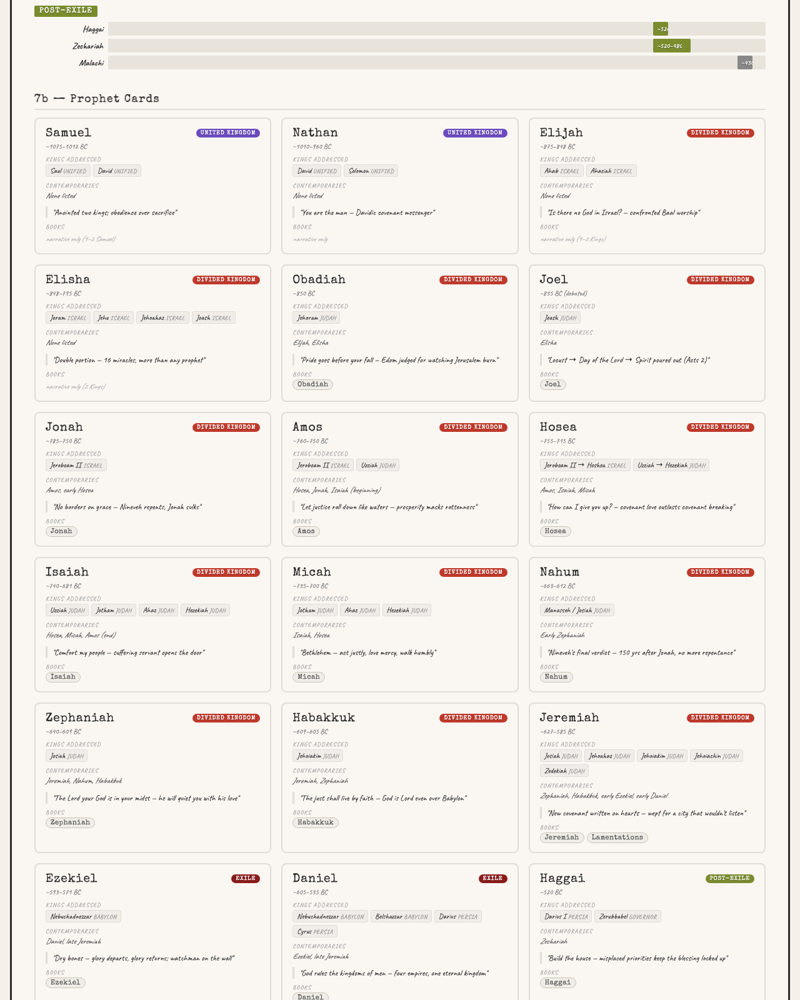

# Bible Teacher — AI Skill Toolkit

A set of Claude Code skills for producing Bible teaching content — visual panels, passage studies, discussion guides, and book comparisons.

Adapted from the [pastor-ai-skills](https://github.com/tkcostello/pastor-ai-skills/) architecture by Thomas Costello.

---

## See It First

Browse sample outputs — every panel was generated from a single skill prompt:

**[ken-muturi.github.io/bible-teacher](https://ken-muturi.github.io/bible-teacher/)**

Book overviews, passage deep studies, discussion guides, timelines, family trees, and the full prophets section — all live examples you can generate yourself once the skills are installed.

---

## Get Claude

This toolkit runs on [Claude](https://claude.ai) by Anthropic.

**Option A — Claude.ai (browser, easiest)**
1. Go to [claude.ai](https://claude.ai) and create a free account
2. Upgrade to Claude Pro for best results (required for long research sessions)
3. Create a **Project** — this keeps your teacher profile and skills persistent across conversations

**Option B — Claude Desktop (recommended for most teachers)**
1. Download the Claude desktop app for [Mac or Windows](https://claude.ai/download)
2. Sign in with your Anthropic account (or create one)
3. Create a **Project** and add your skill files — works identically to Claude.ai but as a native app
4. Upgrade to Claude Pro for best results

**Option C — Claude Code (terminal, for power users)**
1. Install [Node.js](https://nodejs.org) if you don't have it
2. Install Claude Code:
   ```bash
   npm install -g @anthropic-ai/claude-code
   ```
3. Authenticate:
   ```bash
   claude
   ```
   Follow the prompts to connect your Anthropic account.

---

## Install

Pick the version of Claude you use — the setup is different for each.

### 📱 Phone app, the Claude desktop app, or claude.ai in a browser — easiest, no install

**This is the right path for most people, and the only one that works in the phone app.**
You paste the skills into a Claude **Project** once (about 5 minutes), then just type commands
like `passage-study John 3`. No terminal, no downloads, no code. Because a Project is tied to
your account, **set it up once on any device and it's there on all of them** — phone, the
desktop app, and the browser.

**→ One-tap Copy page: [ken-muturi.github.io/bible-teacher/install.html](https://ken-muturi.github.io/bible-teacher/install.html)**
(tap **Copy**, make a Claude **Project**, paste once — done. Full walkthrough:
[mobile/SETUP-ON-YOUR-PHONE.md](mobile/SETUP-ON-YOUR-PHONE.md).)

> ⚠️ The plugin commands below are a **Claude Code** feature. They do **not** work in the phone
> app or on claude.ai. If your friends are on their phones, send them the Copy page above.

### 💻 Claude Code (the terminal, or the "Code" tab of the desktop app)

One command installs **all** the skills at once (recent Claude Code):

```
/plugin install bible-teacher --marketplace ken-muturi/bible-teacher
```

Or the classic two-step (any version):

```
/plugin marketplace add ken-muturi/bible-teacher
/plugin install bible-teacher@bible-teacher
```

That's it. The skills then work automatically — type `passage-study <ref>`,
`book-overview <Book>`, `discussion-guide <Book>`, or `bible-timeline <query>`.
(They're also available with the plugin prefix, e.g. `/bible-teacher:passage-study`.)

**Update later:**

```
/plugin marketplace update bible-teacher
```

### 🗂️ Clone the whole repo (to read, edit, or contribute)

```bash
git clone https://github.com/ken-muturi/bible-teacher.git
cd bible-teacher
claude
```

**Zero commands:** this repo ships a `.claude/settings.json` that registers its own marketplace
and enables the plugin, so opening the folder in Claude Code **auto-installs the plugin**. The
first time you open it, Claude Code shows a one-time **workspace-trust prompt** — accept it and
the skills are ready (nothing else runs; the committed settings contain no scripts or hooks).
If auto-install doesn't trigger on your version, fall back to:

```
/plugin marketplace add .
/plugin install bible-teacher@bible-teacher
```

All generated guides are saved to `guides/` and browsable via `index.html`.
Or [download the ZIP](https://github.com/ken-muturi/bible-teacher/archive/refs/heads/main.zip) and unzip it.

---

## Skills

| Skill | Trigger | What It Does |
|-------|---------|--------------|
| **Teacher Foundation** | Edit `plugins/bible-teacher/skills/teacher-foundation/SKILL.md` (or just tell Claude your details) | Set your tradition, translation, and theology once — all other skills inherit it |
| **Book Overview Infographic** | `book-overview <Book>` | Generates a custom HTML visual panel for any Bible book |
| **Passage Study** | `passage-study <ref>` | Quick overview panel for any verse or chapter |
| **Passage Study (deep)** | `passage-study <ref> --deep` | Full exegetical study — word studies, commentaries, illustrations, chat brief + rich HTML panel |
| **Discussion Guide** | `discussion-guide <Book>` | Small-group study companion for any book |
| **Bible Timeline & Family Tree** | `bible-timeline <query>` | Family tree + lifespan timeline for any biblical figure, era, or the full Adam-to-Jesus overview |

All skills live in `plugins/bible-teacher/skills/`. On the phone/desktop/browser they run from the pasted Project bundle (see Install); in Claude Code they run as an installed plugin.

---

## Setup (do once)

1. Open `plugins/bible-teacher/skills/teacher-foundation/SKILL.md` (phone/browser users: this is the first section of the pasted bundle — or just tell Claude your details in chat)
2. Edit the variables directly in the file — name, context, audience, translation, denomination, preaching posture
3. Includes a full table of 12 Bible translations and denominational tradition options across 6 categories
4. All skill outputs adapt to your profile automatically — commentary recommendations, application bridges, interpretive framing

---

## Outputs

All generated guides are HTML files in `guides/`. Open `index.html` at the project root to browse everything.

### Book Overview Panels
Visual teaching panels — layout adapts to the book's own structure.

| Mode | Trigger | Layout |
|------|---------|--------|
| Default | `book-overview <Book>` | 3-column grid, consistent across all books |
| Non-constrained | `book-overview <Book> --non-constrained` | Layout emerges from the book's structure |

Output: `guides/visuals/<book>-panel.html`

**Examples**

- **Judges** (`--non-constrained`) — downward descent layout, each judge card indented further right as quality deteriorates
- **Amos** (`--non-constrained`) — funnel trap layout, six nations close down onto Israel, enacting the rhetorical trap of chapters 1–2
- **Romans** (`--non-constrained`) — argument cascade, four movements flowing from the 1:16–17 thesis
- **Leviticus** (`--non-constrained`) — two-part arc with ch.16 Day of Atonement as the red hinge


### Passage Studies
Two modes for different use cases:

**Quick** — `passage-study Romans 8:1–11`
Concise panel: 2 word studies, 3-beat structure, 2 illustrations, Then→Now, 2 cross-references.

**Deep** — `passage-study 2 Samuel 12:1–14 --deep`
Full exegetical study: 3–5 word studies, historical context, 3–5 illustrations, 2–3 cited commentaries (named authors), pressure points, full cross-references. Outputs a chat brief first, then a rich HTML panel.

Output: `guides/passages/<book-chapter-verse>-study.html`


### Book & Passage Comparisons
Side-by-side panels showing two books or passages in parallel.

- **Judges × Amos** — same covenant failure 300 years apart, neglect vs. injustice
- **2 Samuel 11 × Psalm 51** — the fall and the return, narrative vs. prayer, diptych layout with arc strip

Output: `guides/visuals/<name>-comparison.html` or `guides/passages/<name>.html`


### Timelines & Family Trees

Visual panels showing who lived when, how they were related, who was alive at the same time, and which books were written during each era.

| Query | What is generated |
|-------|------------------|
| `bible-timeline <person>` | Family tree + contemporaries + books for that figure (e.g. `bible-timeline Moses`) |
| `bible-timeline <family>` | Genealogical tree for a clan (e.g. `bible-timeline Patriarchs`, `bible-timeline David's line`) |
| `bible-timeline <period>` | All major figures in that era + books (e.g. `bible-timeline exile`) |
| `bible-timeline full` | Full overview — Adam to Jesus |

Each panel includes:
- **Era bands** — colour-coded from Antediluvian through New Testament
- **Lifespan bars** — horizontal bars showing when each figure lived (AM + BC dates)
- **Family tree** — all children at every generation (Cain/Abel/Seth, Noah's sons with nations, Abraham's 8+ children, Jacob's 13 by mother, Jesse's 8 sons, David's line to the kingdom split)
- **Contemporaries** — who was alive at the same time (e.g. Abraham could have met Shem; Jeremiah and Daniel were both alive at the fall of Jerusalem)
- **Books in context** — which biblical books were written or set in each era
- **Structural pivots** — why Levi became priests, why Judah holds the scepter, why Ephraim overtook Manasseh, the Melchizedek mystery, and more
- **Prophets & Their Times** — timeline strip, prophet cards, and prophet-king matrix (see below)

Also available: **The Spine of Biblical History** — 20 pivotal events with books written, prophets active, excluded/lost books, and the full canon formation story (Protestant 66 vs Catholic 73 vs Orthodox 78).

### Prophets & Their Times

The full `bible-timeline full` panel includes a dedicated prophets section with three views:

| View | What it shows |
|------|--------------|
| **Timeline strip** | Horizontal bars for all 20 prophets (Samuel → Malachi) plotted from 1100–400 BC, coloured by era |
| **Prophet cards** | One card per prophet — dates, era chip, kings they addressed (with kingdom label), contemporaries, key message, book(s) |
| **Prophet-King matrix** | 20 prophets × 21 kings — ● primary address, ◦ contemporary reign, grouped by kingdom (United / Israel / Judah / Foreign) |



Output: `guides/visuals/bible-timeline-<query>.html`

### Discussion Guides
One-page printable HTML companion for small groups, classrooms, or self-study.

Each guide includes: Before You Engage questions, Key Terms, Discussion Questions (tagged Observation / Context / Application), Going Deeper resources, and a Closing Thought.

Output: `guides/discussions/<book>-discussion-guide.html`


---

## PDF Export

Every HTML panel has a **↓ Save as PDF** button — click it and use your browser's print dialog to save as PDF.

For batch export via script:

```bash
# Install dependency (once)
pip3 install -r requirements.txt

# Convert a specific file
python3 scripts/to-pdf.py guides/discussions/judges-discussion-guide.html

# Convert all guides and panels at once
python3 scripts/to-pdf.py --all
```

Discussion guides → A4 portrait. Visual panels → A3 landscape. PDFs saved alongside the HTML files.

---

## Typical Workflow

```
1. passage-study <ref>                   →  quick study panel
   passage-study <ref> --deep            →  full exegetical study
2. book-overview <Book>                  →  visual teaching panel
3. discussion-guide <Book>              →  companion resource for groups
```

---

## Browse All Guides

Open `index.html` in your browser (or at `http://localhost:7654/index.html` if running the preview server) to browse all generated guides by category, with clickable cards for every panel, study, comparison, and discussion guide.

---

## Channel Curriculum

See `CURRICULUM.md` for the full 66-book curriculum organized into 9 playlist series.

**Suggested starting order:** Mark → Genesis → Romans → Psalms

---

## Philosophy

These are research and structure tools. They do not teach for you.
The historical knowledge, interpretive judgment, application bridges, and pastoral instinct are yours.

Skills cite real commentaries — named authors, named works — so you can follow the footnotes yourself.
