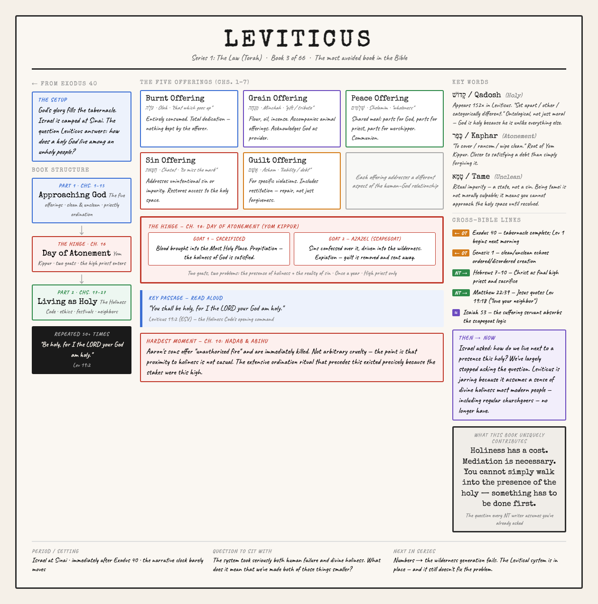
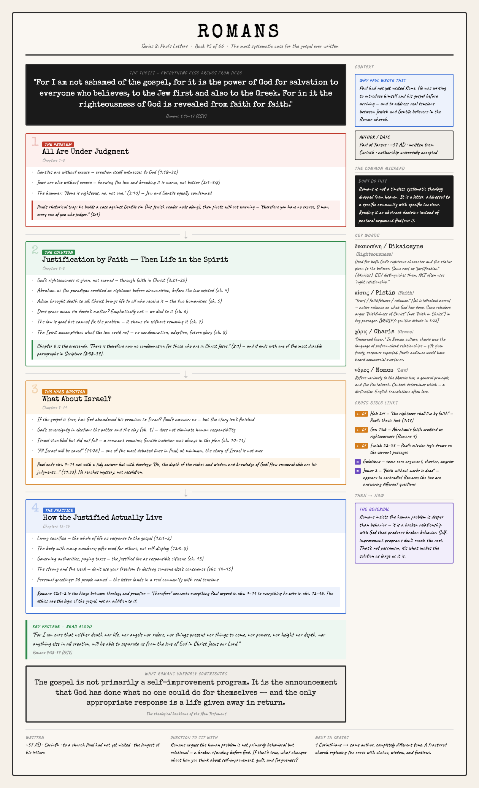
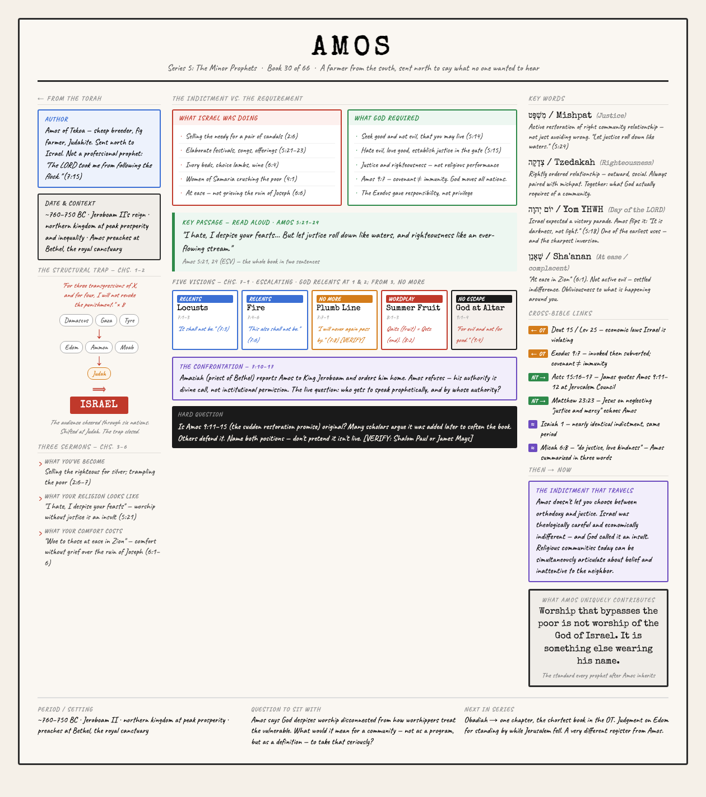
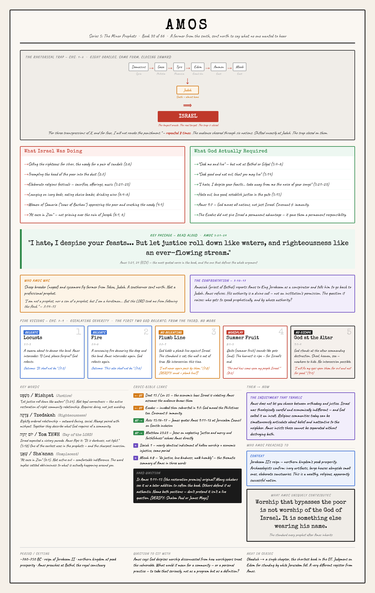

# Bible Teacher — AI Skill Toolkit

A set of workflow tools for producing YouTube Bible teaching content.
Adapted from the [pastor-ai-skills](https://github.com/tkcostello/pastor-ai-skills/) architecture by Thomas Costello.

---

## Setup (do this once)

1. Open `foundation/teacher-foundation/SKILL.md`
2. Fill in your six profile variables (name, channel, audience, translation, posture, tone)
3. That foundation is then referenced by all other skills automatically

---

## Skills

| Skill | File | What It Does |
|-------|------|--------------|
| Teacher Foundation | `foundation/teacher-foundation/SKILL.md` | Personalizes all outputs with your profile |
| Book Overview | `book-overview/SKILL.md` | Deep research brief for any of the 66 books |
| Book Overview Infographic | `book-overview-infographic/SKILL.md` | HTML visual teaching panel from the research brief |
| Video Outline | `video-outline/SKILL.md` | Talking-points outline for an 18-22 min video |
| Discussion Guide | `discussion-guide/SKILL.md` | Printable study companion for groups |

---

## Workflow Per Book

```
1. Run book-overview             →  research brief
2. Run book-overview-infographic →  HTML visual teaching panel
3. Run video-outline             →  talking-points structure
4. Film your video
5. Run discussion-guide          →  companion resource
```

---

## Infographic Layout Modes

```
book-overview-infographic genesis                      # 3-column grid (default)
book-overview-infographic judges --non-constrained     # theme-driven layout
```

The default 3-column layout is consistent and printable across all 66 books.
`--non-constrained` lets the layout emerge from the book's own structure.

---

## Sample Infographics

### Judges — `--non-constrained` (downward descent layout)
The layout mirrors the book's spiral: each judge card is indented further right as quality deteriorates, collapsing into a dark zone for chapters 17–21 where no judge appears.


---

### Leviticus — `--non-constrained` (two-part arc layout)
Structured around the two halves of the book with the Day of Atonement (ch. 16) as the red hinge between "Approaching God" and "Living as Holy."



---

### Romans — `--non-constrained` (argument cascade layout)
Four numbered movements flow downward from the thesis (1:16–17), each feeding logically into the next: Problem → Solution → Israel Question → Practice.



---

### Amos — 3-column (default layout)
Standard three-column grid: left holds identity, the compact trap diagram, and three-sermon summary; center holds the indictment/requirement contrast, key passage, five visions, and confrontation; right holds key words, cross-links, and application.



---

### Amos — `--non-constrained` (funnel trap layout)
The rhetorical trap structure drives the layout: six nations flow across the top, close down through Judah, then snap onto Israel — visually enacting what Amos does rhetorically in chapters 1–2. Below: the indictment vs. requirement contrast, the full-width 5:24 passage, five escalating visions, and the application grid.



---

## Channel Curriculum

See `CURRICULUM.md` for the full 66-book curriculum organized into 9 playlist series.

**Suggested starting order:** Mark → Genesis → Romans → Psalms

---

## Philosophy

These are research and structure tools. They do not teach for you.
The historical knowledge, interpretive judgment, and application are yours.
